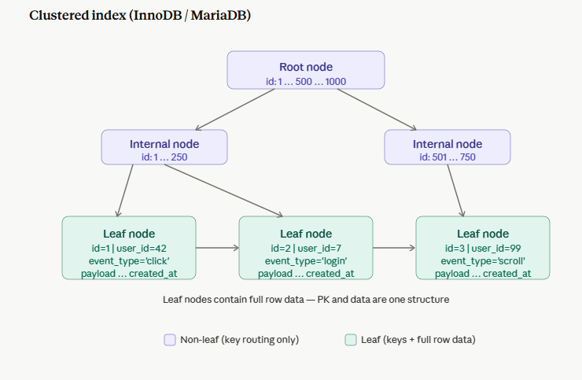
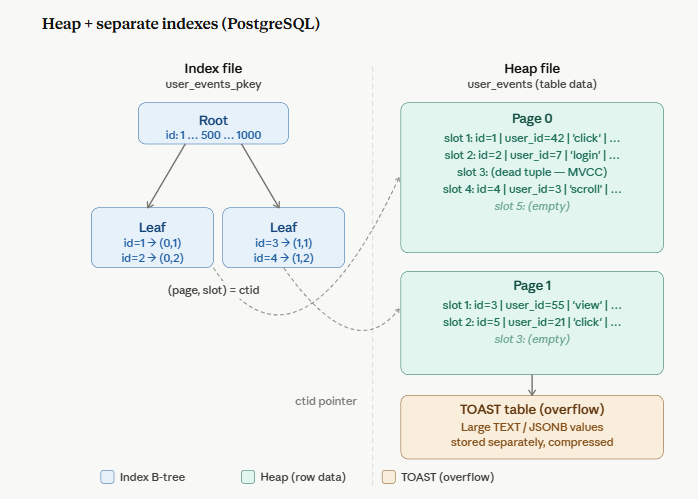

At the core, every database must answer one question: **where does the actual row data live relative to the index?** The two dominant answers are *clustered* (data lives inside the index) and *heap-based* (data and indexes are separate structures).

### MySql

- In InnoDB, the **primary key B-tree is the table**. Leaf nodes physically store the full row. There is no separate place on disk for the data, it's all one `.ibd` file.
- PK lookup = one B-tree traversal, you arrive at the full row. No second fetch.
- Secondary indexes store the PK value at their leaf, not a physical pointer. A lookup needs two traversals: secondary index → find PK → walk the clustered index again. This is called a **double lookup**.
- Choosing a poor PK (like a random UUID) causes **page splits and fragmentation** because InnoDB must keep rows physically ordered by PK.

### PostgreSQL

- In PostgreSQL, the table data lives in a **heap** — an unordered pile of pages — and every index, including the PK, is a completely separate B-tree file that stores `(key, ctid)` pairs. A `ctid` is a physical tuple pointer: `(page_number, slot_number)`.
- Any lookup via index = two I/Os: index B-tree → `ctid` → heap fetch.
- All indexes are equal citizens. There's no "special" PK index that stores rows. Secondary indexes and PK indexes are structurally identical files.
- Table pages are **not ordered** by any key. Rows land wherever there's free space after inserts and updates.

### Secondary index comparison

<table>
  <tr><th>Topic</th><th>InnoDB (MariaDB)</th><th>PostgreSQL</th></tr>
  <tr><td>Secondary index leaf stores</td><td>PK value</td><td>ctid (physical page+slot)</td></tr>
  <tr><td>Lookup path</td><td>Index → PK value → clustered index walk</td><td>Index → ctid → heap page</td></tr>
  <tr><td>After UPDATE on indexed column</td><td>PK stays stable, secondary index entry stays valid</td><td>ctid changes → all indexes on that row must be updated</td></tr>
  <tr><td>Heap fragmentation</td><td>No heap; fragmentation is in the clustered B-tree</td><td>Dead tuples pile up in heap until VACUUM reclaims them</td></tr>
</table>

```sql
CREATE TABLE user_events
(
    id         BIGSERIAL PRIMARY KEY,
    user_id    BIGINT      NOT NULL,
    event_type VARCHAR(50) NOT NULL,
    created_at TIMESTAMPTZ NOT NULL
);
```




