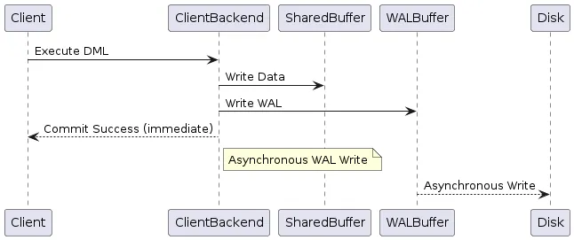

In PostgreSQL, the `synchronous_commit` configuration parameter plays a critical role in determining how transactions are committed and when the client receives acknowledgment of a transaction's success.

The `synchronous_commit` setting in PostgreSQL can be configured at session, transaction, database, and cluster-wide scopes, allowing for flexibility in managing transaction durability based on different levels of granularity and applicability.

### Components Involved in Transaction Handling

- **Shared Buffer**: When a DML (Data Manipulation Language) operation (e.g., `INSERT`, `UPDATE`, `DELETE`) is executed, the client backend first writes the data into the shared buffer. The shared buffer is an in-memory cache that holds recently accessed data pages, optimizing read and write operations.
- **Write-Ahead Logging (WAL) Buffer**: Simultaneously, the backend writes the transaction changes into the WAL buffer. The WAL buffer is a separate area where PostgreSQL logs all changes made by transactions before they are applied to the data files on disk. This logging mechanism ensures data durability and crash recovery.
- When synchronous_commit is ON:
  - The client backend writes data to the shared buffer and WAL buffer.
  - PostgreSQL waits for the WAL writer process to flush the WAL data to disk, ensuring it’s durably stored.
  - **When to use:** mission-critical data.
- When synchronous_commit is OFF:
  - The backend immediately returns a transaction success status to the client after writing to the shared buffer and WAL buffer.
  - The WAL writer asynchronously flushes the WAL data to disk. If the server crashes before this occurs, there’s a risk of data loss.
  - Can boost transaction speed by reducing the I/O wait for disk writes but increases the risk of losing un-flushed data in case of a crash.
  - Transactions complete faster since there's no waiting for disk writes.
  - **When to use:** data ingestion pipelines, logging, cache or temporary data storage.

